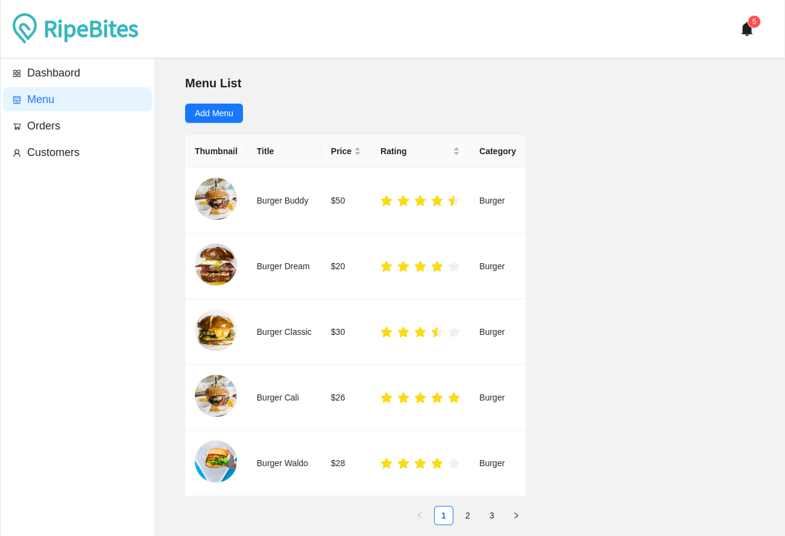
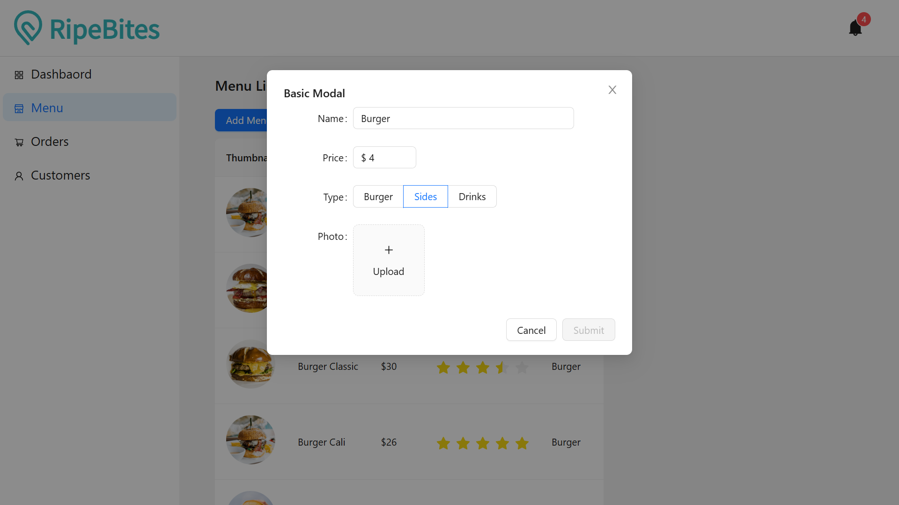
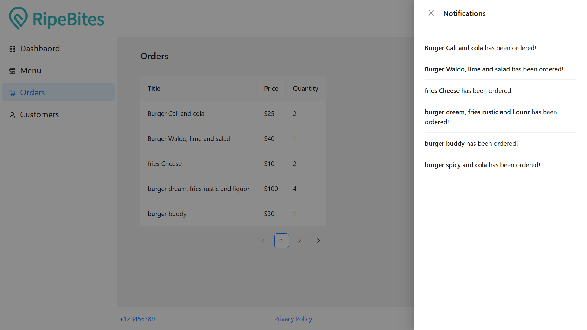

<h1 align="center">
  Admin Dashboard
</h1>
<div align="center">
  
</div>


## Description

Admin-dashboard is webapp that help to manage and get insight of our website

## Built With

- [React.js]
- [Antd]

## 🛠 Installation & Set Up

1. Clone the repo
   ```sh
   git clone https://github.com/rdhss/admin-dashboard.git
   ```
1. change dir
   ```sh
   cd admin-dahboard
   ```
2. Install NPM packages
   ```sh
   npm install
   ```
3. Start the Application
   ```sh
   npm start
   ```


## Screenshoot

<div align="center">
  
</div>

<div align="center">
  
</div>

<div align="center">
  
</div>